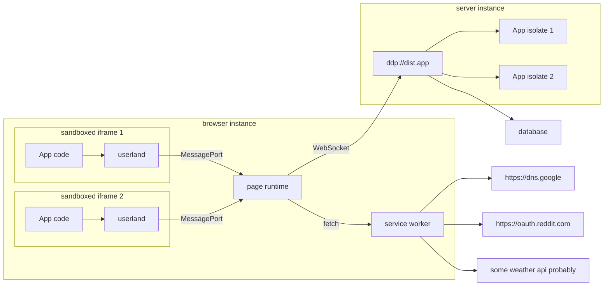

## system architecture

```mermaid
graph LR
    subgraph browser instance
        subgraph sandboxed iframe 1
            usercode1[App code] --> userland1[userland]
        end
        subgraph sandboxed iframe 2
            usercode2[App code] --> userland2[userland]
        end
        userland1 -->|MessagePort| browser[page runtime]
        userland2 -->|MessagePort| browser
        browser -->|fetch| sw[service worker]
    end
    subgraph server instance
        browser -->|WebSocket| server[ddp://dist.app]
        server --> isolate1[App isolate 1]
        server --> isolate2[App isolate 2]
    end
    server --> database
    sw --> dns[https://dns.google]
    sw --> dagd[https://oauth.reddit.com]
    sw --> weather[some weather api probably]
```
