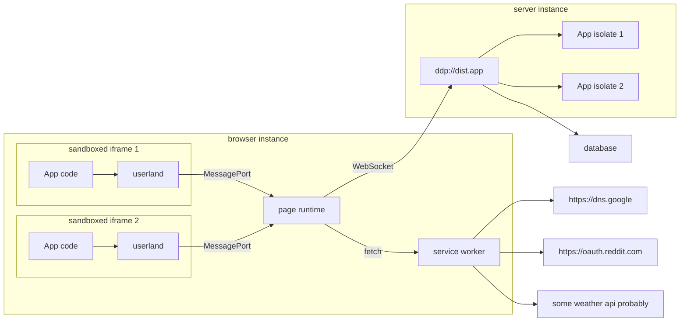
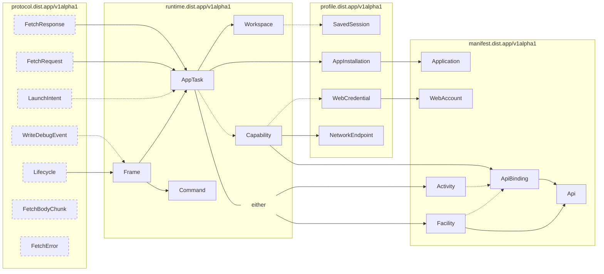

## disclaimer
this is a proof of concept. do not invest in it, emotionally or otherwise.

## screenshot

## system architecture

```mermaid
graph LR
    subgraph browser instance
        subgraph sandboxed iframe 1
            usercode1[App code] --> userland1[userland]
        end
        subgraph sandboxed iframe 2
            usercode2[App code] --> userland2[userland]
        end
        userland1 -->|MessagePort| browser[page runtime]
        userland2 -->|MessagePort| browser
        browser -->|fetch| sw[service worker]
    end
    subgraph server instance
        browser -->|WebSocket| server[ddp://dist.app]
        server --> isolate1[App isolate 1]
        server --> isolate2[App isolate 2]
    end
    server --> database
    sw --> dns[https://dns.google]
    sw --> dagd[https://oauth.reddit.com]
    sw --> weather[some weather api probably]
```

## entity relationships

```mermaid
graph LR
    subgraph runtime.dist.app/v1alpha1
        Impl[either]:::either
    end
    subgraph manifest.dist.app/v1alpha1
        Application
        WebAccount
        Facility -.-> ApiBinding
        Activity -.-> ApiBinding
        Facility --> Api
        ApiBinding --> Api
        Impl ---> Activity
        Impl --> Facility
    end
    subgraph profile.dist.app/v1alpha1
        SavedSession
        AppInstallation --> Application
        WebCredential --> WebAccount
        NetworkEndpoint
    end
    subgraph runtime.dist.app/v1alpha1
        AppTask --> AppInstallation
        AppTask --- Impl
        Frame --> AppTask
        Frame --> Command
        AppTask -.-> Capability
        Capability -.-> WebCredential
        Capability --> ApiBinding
        Capability --> NetworkEndpoint
        Workspace -.-> SavedSession
        AppTask --> Workspace
        Command
    end
    subgraph protocol.dist.app/v1alpha1
        Lifecycle:::dashed --> Frame
        LaunchIntent:::dashed -.-> AppTask
        WriteDebugEvent:::dashed -.-> Frame
        FetchRequest:::dashed --> AppTask
        FetchResponse:::dashed --> AppTask
        FetchBodyChunk:::dashed
        FetchError:::dashed
    end
    classDef either stroke: none, fill: none
    classDef dashed stroke-dasharray: 5 5
```
